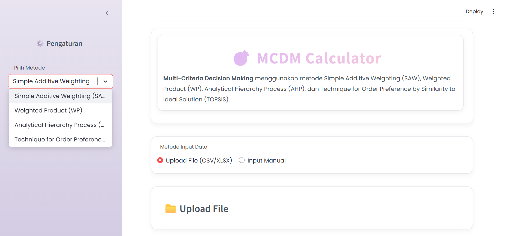
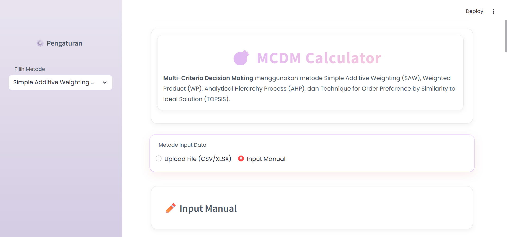
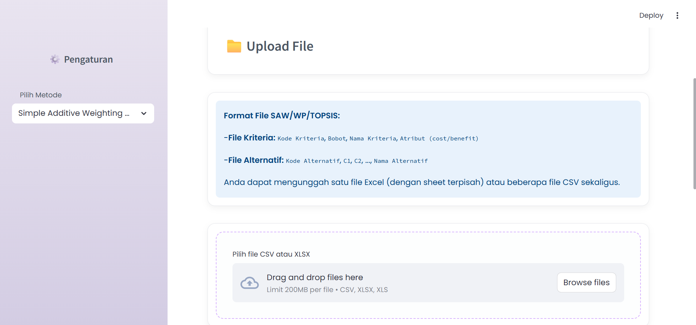
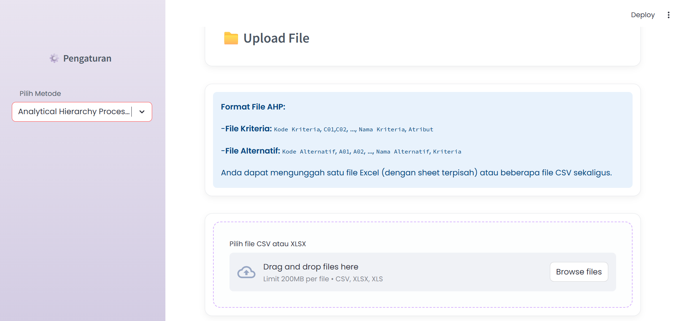
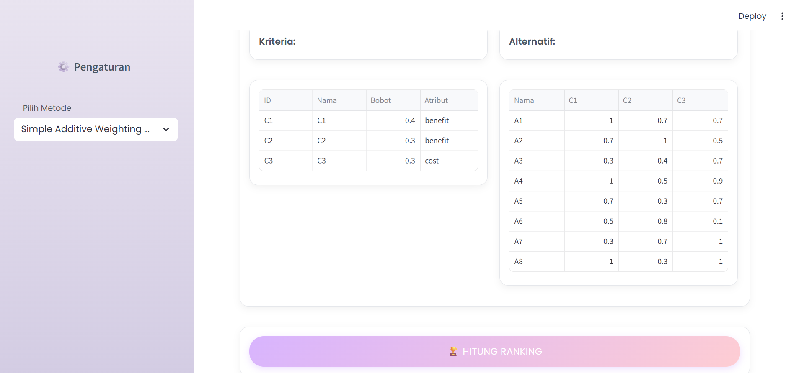
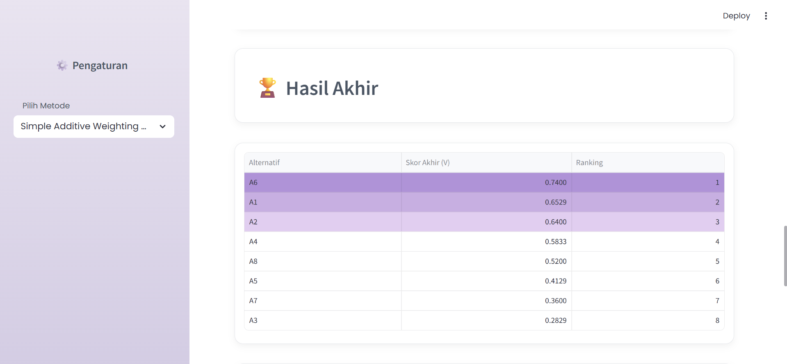
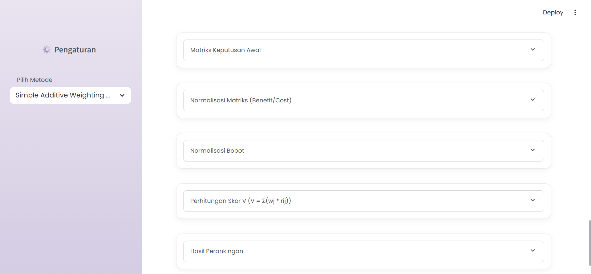
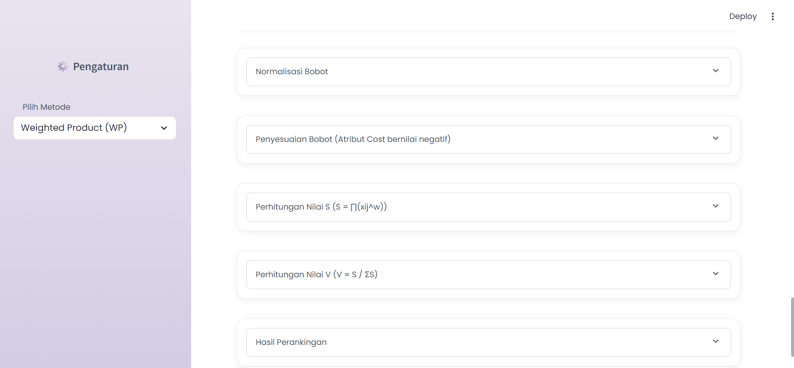
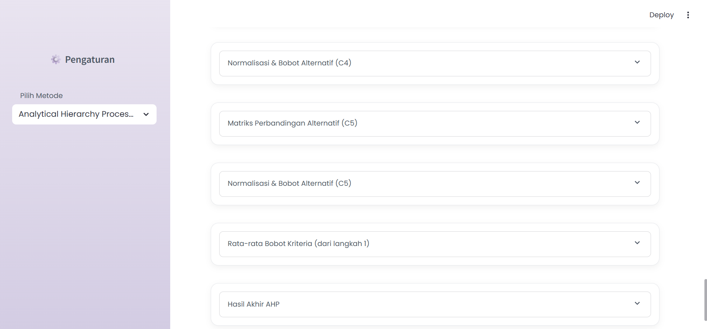
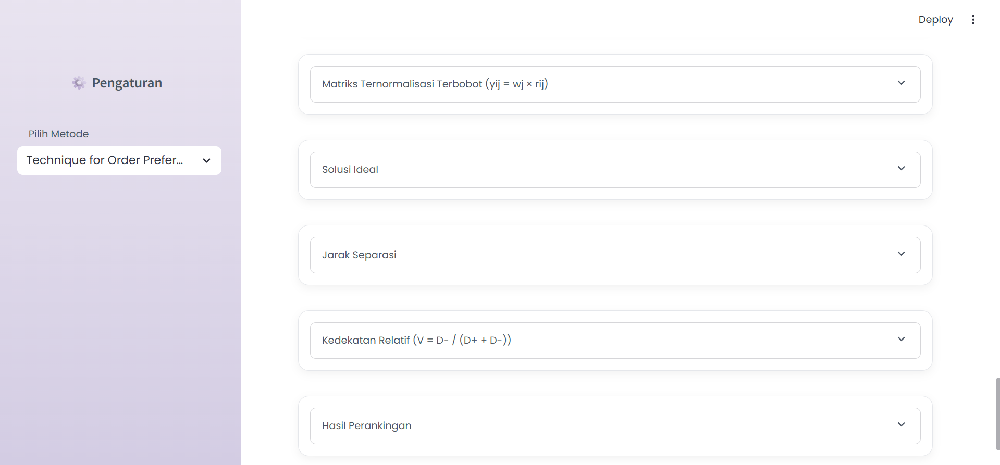

# 🧠 Decision Support System (DSS) - Multi Criteria Decision Making (MCDM)
**Nazwa Nashatasya – 140810230019**  
**Senia Nur Hasanah – 140810230021**

---

## 🪄 Deskripsi Singkat
Aplikasi **Sistem Pendukung Keputusan (Decision Support System / DSS)** ini membantu pengguna dalam melakukan **Multi Criteria Decision Making (MCDM)** menggunakan beberapa metode populer, yaitu:

- **Simple Additive Weighting (SAW)**
- **Weighted Product (WP)**
- **Analytical Hierarchy Process (AHP)**
- **Technique for Order of Preference by Similarity to Ideal Solution (TOPSIS)**

Aplikasi dibangun menggunakan **Streamlit**, sehingga dapat dijalankan secara interaktif melalui browser dan memudahkan pengguna dalam menganalisis alternatif berdasarkan kriteria yang ditentukan.  
Tampilan aplikasi menggunakan **CSS eksternal (`style.css`)** dengan desain modern dan lembut.

---

## 🧭 Panduan Penggunaan Aplikasi

### 1️⃣ Pilih Metode
Di panel **sidebar kiri**, pengguna akan menemukan pilihan **“Pilih Metode”**.  
Tersedia empat metode **MCDM**, yaitu:

- `Simple Additive Weighting (SAW)`
- `Weighted Product (WP)`
- `Analytical Hierarchy Process (AHP)`
- `TOPSIS`

> Pilih salah satu metode untuk digunakan dalam proses perhitungan.

📸 **Ilustrasi:**

---

### 2️⃣ Pilih Metode Input Data
Masih di **sidebar**, pilih cara input data:

- **Upload File (CSV/XLSX)** → jika data sudah disiapkan dalam file spreadsheet.  
- **Input Manual** → jika ingin mengetikkan nilai langsung di dalam aplikasi.

📸 **Ilustrasi:**

---

### 3️⃣ Struktur Data Input
Setiap metode membutuhkan format file yang berbeda agar sistem dapat membaca data dengan benar.

#### 🟢 Untuk SAW, WP, dan TOPSIS
Metode ini membutuhkan **dua file** sebagai inputnya, yaitu:

#### 1. Input Kriteria
| Kode Kriteria | Bobot | Nama Kriteria | Atribut |
| -------------- | ------ | -------------- | -------- |
| C1             | 0.4    | Harga          | cost     |
| C2             | 0.3    | Kualitas       | benefit  |
| C3             | 0.3    | Pelayanan      | benefit  |

#### 2. Input Alternatif
| Kode Alternatif | C1   | C2 | C3 |
| ---------------- | ---- | -- | -- |
| A1               | 2000 | 7  | 8  |
| A2               | 1800 | 6  | 7  |
| A3               | 2200 | 8  | 9  |

📸 **Ilustrasi:**

---

#### 🔵 Untuk AHP
Metode AHP memerlukan **dua file** sebagai inputnya, yaitu:

1️⃣ **Input Perbandingan Antar Kriteria**  
Menentukan seberapa penting satu kriteria dibandingkan yang lain.

2️⃣ **Input Perbandingan Antar Alternatif (per Kriteria)**  
Menentukan nilai perbandingan antar alternatif terhadap setiap kriteria.

📸 **Ilustrasi:**

---

### 4️⃣ Proses Perhitungan
Setelah file diunggah atau data diinput secara manual:

- Aplikasi akan **membaca data otomatis** dan menampilkan data yang telah diinput.
- Setelah data terbaca, klik tombol **Hitung Ranking**.
- Hasil perhitungan dan langkah-langkah akan muncul di layar.

📸 **Ilustrasi:**

---

### 5️⃣ Hasil dan Visualisasi
- Setelah proses selesai, hasil akan muncul dalam bagian **Hasil Akhir**.
- Ditampilkan juga proses setiap **Langkah Perhitungan** dari metode yang digunakan.
- Ranking dan skor akhir disusun berdasarkan metode terpilih.

📸 **Ilustrasi:**

---

### 6️⃣ Contoh Perhitungan SAW
Langkah SAW meliputi:
1. Matriks Keputusan Awal
2. Normalisasi Matriks (Benefit/Cost)
3. Perhitungan Skor V (V = Σ(wj * rij))
4. Hasil Perankingan

📸 **Ilustrasi:**

---

### 7️⃣ Contoh Perhitungan WP
Langkah WP meliputi:
1. Matriks Keputusan Awal 
2. Normalisasi Bobot
3. Penyesuaian Bobot (Atribut Cost bernilai negatif)
4. Perhitungan Nilai S (S = ∏(xij^w))
5. Perhitungan Nilai V (V = S / ΣS)
6. Hasil Perankingan

📸 **Ilustrasi:**

---

### 8️⃣ Contoh Perhitungan AHP
Langkah AHP meliputi:
1. Matriks Perbandingan Kriteria 
2. Normalisasi Matriks Kriteria
3. Bobot Kriteria
4. Uji Konsistensi Kriteria
5. Matriks Perbandingan Alternatif 
6. Normalisasi & Bobot Alternatif 
7. Rata-rata Bobot Kriteria (dari langkah 1)
8. Hasil Akhir AHP

📸 **Ilustrasi:**

---

### 9️⃣ Contoh Perhitungan TOPSIS
Langkah TOPSIS meliputi:
1. Matriks Keputusan Awal
2. Matriks Ternormalisasi (rij = xij / √(Σxij²))  
3. Matriks Ternormalisasi Terbobot (yij = wj × rij)
4. Solusi Ideal
5. Jarak Separasi
6. Kedekatan Relatif (V = D- / (D+ + D-))
7. Hasil Perankingan

📸 **Ilustrasi:**

---

## 🧩 Contoh Alur Penggunaan
1. Di sidebar, pilih salah satu metode (misal **SAW**).
2. Upload dua file: `kriteria.csv` dan `alternatif.csv`.
3. Klik **Hitung Ranking**.
4. Lihat hasil ranking dan proses lengkap di tampilan utama.

---

## 🪶 Catatan
- Aplikasi ini dirancang agar fleksibel: bisa menerima input file atau manual.  
- Tampilan didesain pastel lembut untuk pengalaman visual yang nyaman.  
- Dibangun menggunakan **Python + Streamlit**.

---

## 🖼️ Dokumentasi Langkah-langkah
| Langkah | Gambar | Deskripsi |
|----------|--------|------------|
| 1 |  | Pilih metode MCDM |
| 2 |  | Pilih cara input data |
| 3 |  | Lihat contoh format file |
| 4 |  | Upload file AHP atau lainnya |
| 5 |  | Proses perhitungan dimulai |
| 6 |  | Hasil sementara muncul |
| 7 |  | Hasil SAW ditampilkan |
| 8 |  | Hasil WP ditampilkan |
| 9 |  | Hasil AHP ditampilkan |
| 10 |  | Hasil TOPSIS ditampilkan |

---

✨ *DSS - Multi Criteria Decision Making (MCDM) by Nazwa & Senia (2025)* ✨
